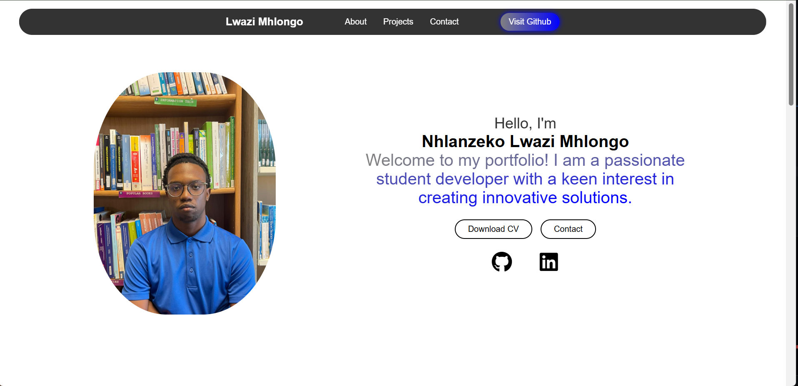

🌐 Personal Portfolio – Lwazi Mhlongo

This is my personal portfolio website, built with HTML, CSS, and JavaScript, and The site is deployed with **GitHub Pages** and linked to a custom domain:  
👉 🔗[lwazimhlongo.com](http://lwazimhlongo.com)
It showcases my projects, skills, and ways to connect with me.

✨ Features

Responsive design (works on desktop, tablet, and mobile)

Navigation bar with smooth scrolling

Linked buttons & icons:
  - GitHub profile
  - LinkedIn profile
  - Contact section

About section with introduction and social links

Projects showcase (more coming soon 🚀)

Contact section with ways to reach me
    Contact form automation:
        - Visitors can enter their email and click "Submit" to open their email client with a pre-filled message.

Integrated with Google Analytics

🛠️ Tech Stack

Frontend: HTML, CSS, JavaScript

Icons: Font Awesome

Deployed with: GitHub Pages, Hosted on Custom Domain

Analytics: Google Analytics

📸 Preview

📬 Contact

GitHub: [Lwazi-M](https://github.com/Lwazi-M)

LinkedIn: [Nhlanzeko (Lwazi) Mhlongo](https://www.linkedin.com/in/nhlamhlongo/)

Email: Nhlanzeko L. Mhlongo (nhlamhlongo.work@gmail.com)
